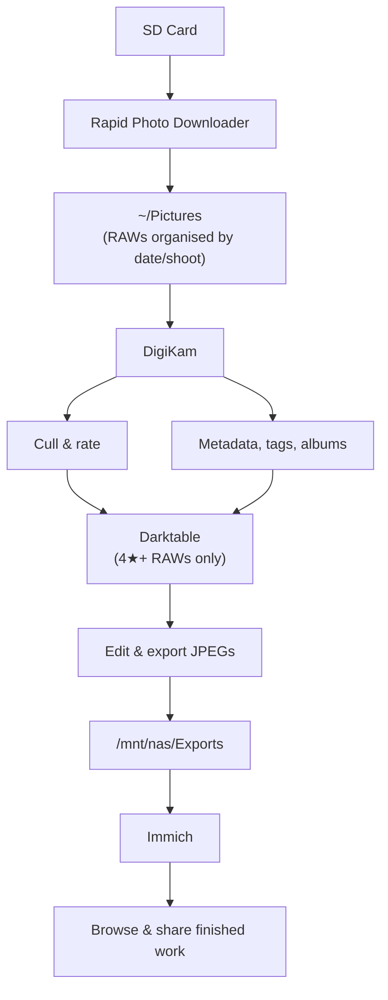

# Photography Workflow

This repository contains the configuration files, scripts, and deployment manifests for my open-source photography workflow. It treats photography asset management and raw processing as a code deployment, allowing for easy replication across multiple machines (desktop, travel laptop, home server).

## 🛠 The Stack

Ingestion: [Rapid Photo Downloader](https://damonlynch.net/rapid/) (Linux-based EXIF-aware automated ingestion)

Digital Asset Management (DAM): [DigiKam](https://www.digikam.org/) (backed by a remote MariaDB instance)

Raw Processing: [Darktable](https://www.darktable.org/) (configured for scene-referred workflows and Fujifilm X-Trans files)

Serving & Presentation: Immich (Docker-hosted, pointing to Darktable export directories)

Database: MariaDB (Docker-hosted, backing DigiKam's asset index)

Containers: Docker (runs MariaDB and Immich)

Config Management: GNU Stow (symlinks repo configs into `~/.config`)

Cloud Sync: rclone (migrates photo library from Google Drive to NAS)

## 📸 Workflow



RAWs stay in `~/Pictures` (and eventually on the NAS). DigiKam's role ends once files are rated and handed to Darktable. Immich only ever sees the finished JPEGs.

## 📂 Repository Structure

I use GNU Stow to manage these dotfiles.

```text
.
├── darktable/
│   ├── luarc                  # Lua script initialization
│   ├── lua/                   # Custom lifecycle scripts (e.g., auto-film simulations)
│   └── styles/                # Fujifilm .dtstyle files
├── docker/
│   ├── docker-compose.yml     # Manifest for MariaDB and Immich
│   └── .env.example           # Template for environment variables
├── scripts/
│   ├── export_jpegs.sh        # Headless darktable-cli batch processor
│   └── sync_digikam.sh        # XMP metadata sync utility
├── .gitignore
└── README.md
```

## 🔒 Security & Secrets Management (CRITICAL)

Because this is a public repository, no passwords, API keys, or IP addresses are committed here. All sensitive data is injected via environment variables.

### 1. The .gitignore Guard

Ensure your .gitignore includes the following lines to prevent accidental commits of local secrets or massive database files:

```gitignore
# Secrets

.env
.env.local
*.secret

# Local Databases & Caches

*.db
*.sqlite
data.db
library.db
thumbnails/
```

### 2. Using .env Files

For the Docker services (Immich, MariaDB for DigiKam), the docker/docker-compose.yml file uses variable interpolation:

## Example snippet from docker-compose.yml

```yaml
services:
  digikam_db:
    image: mariadb:10.11
    environment:
      MYSQL_ROOT_PASSWORD: ${DB_ROOT_PASSWORD}
      MYSQL_DATABASE: digikam
      MYSQL_USER: ${DB_USER}
      MYSQL_PASSWORD: ${DB_PASSWORD}
```

To run this locally without exposing credentials:

Copy the template: cp docker/.env.example docker/.env

Edit docker/.env with your actual passwords.

Run docker compose up -d (Docker automatically reads the .env file).

## 🚀 Installation

To replicate this workflow on a new Linux machine:

### 1. Install GUI applications

Install via your distro's app store (Flatpak recommended for latest versions):

- [Darktable](https://www.darktable.org/)
- [DigiKam](https://www.digikam.org/)
- [Rapid Photo Downloader](https://damonlynch.net/rapid/)

### 2. Install CLI tools

```bash
# Dotfile symlink manager
sudo apt install stow

# Cloud sync (Google Drive → NAS migration)
sudo apt install rclone

# Container runtime
sudo apt install docker.io docker-compose-v2
sudo usermod -aG docker $USER  # log out and back in after this
```

### 3. Clone this repository

```bash
git clone https://github.com/pjrobot/photography-workflow.git
```

### 4. Symlink configs with Stow

```bash
cd photography-workflow
stow -t ~/.config darktable
```

### 5. Set up your .env file and spin up the database

```bash
cp docker/.env.example docker/.env
# Edit docker/.env with your credentials
docker compose -f docker/docker-compose.yml up -d
```

## 📜 Included Scripts

`darktable/lua/fuji_auto_style.lua`: Hooks into the Darktable import process. It reads EXIF data to detect Fujifilm camera models and automatically applies the correct base curve and default film simulation style to save time.

`scripts/export_jpegs.sh`: A bash wrapper for darktable-cli. It watches a specific directory for .RAF files rated 4 stars or higher (via XMP sidecars generated by DigiKam) and compiles them into a designated /exports folder for Immich to pick up.
